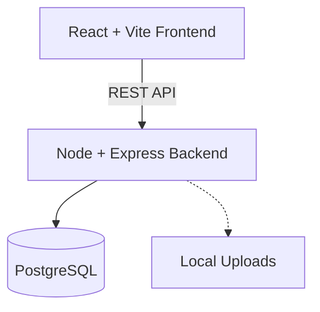

# Investigation Intelligence Platform (IIP)


## Overview
The Investigation Intelligence Platform (IIP) is an open-source cybersecurity platform designed for investigators to manage cases, organize evidence, and analyze relationships seamlessly.

## Problem Statement
Cybersecurity and forensic investigations often suffer from scattered data, lack of chronological timelines, and missing relationship mapping. IIP solves this by offering a centralized hub for case management and evidence correlation.

## Motivation
To build an accessible, secure, and intuitive tool for security researchers and investigators, empowering them with a unified interface and robust data architecture.

## Architecture Diagram


## Key Features
- **Case Management:** Create, view, update, and manage investigation cases.
- **Evidence Timeline:** Upload images, PDFs, URLs, and notes to a visually chronological timeline.
- **Modern UI:** Built with Tailwind CSS, utilizing a slick cybersecurity-themed dark mode.

## Implementation Status
- **Phase 1: Case Management** ✅
- **Phase 2: Evidence Management** ✅
- **Phase 3: Entity Extraction** ✅
- **Phase 4: Relationship Engine** 🚧
- **Phase 5: Intelligence Graph Visualization** 🚧
- **Phase 6: Report Generation** 🚧

## Technology Stack
- **Frontend:** React, Vite, Tailwind CSS v3, React Router, Lucide React
- **Backend:** Node.js, Express.js, Multer (File Uploads)
- **Database:** PostgreSQL (pg)

## Installation & Setup

1. **Clone the repository:**
   ```bash
   git clone https://github.com/your-github-username/Investigation-Intelligence-Platform.git
   cd Investigation-Intelligence-Platform
   ```

2. **Database Setup:**
   Run the SQL scripts in `server/init.sql` on your local PostgreSQL database, or use the node migration script `node server/run_migration.js` after setting environment variables.

3. **Backend Setup:**
   ```bash
   cd server
   npm install
   cp .env.example .env # Update with DB credentials
   npm start
   ```

4. **Frontend Setup:**
   ```bash
   cd client
   npm install
   npm run dev
   ```

## Folder Structure
```text
Investigation-Intelligence-Platform/
├── client/          # React + Vite frontend
├── server/          # Node + Express backend
└── docs/            # Comprehensive documentation
```

## Screenshots
> *(Placeholders for UI Screenshots)*
> - Dashboard View
> - Case Details View
> - Evidence Upload Modal

## Contributing
Please see our [CONTRIBUTING.md](./CONTRIBUTING.md) for details on our code of conduct and the process for submitting pull requests.

## License
This project is licensed under the MIT License - see the [LICENSE](./LICENSE) file for details.
