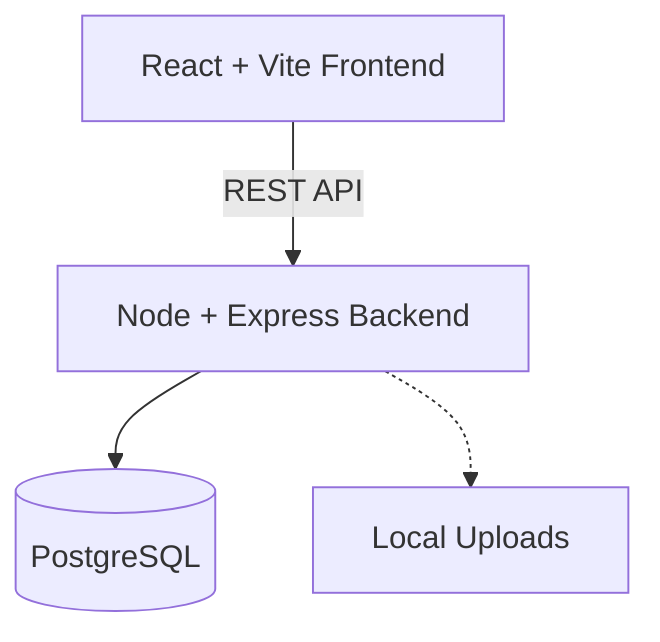

# Architecture Overview

## Component Diagram

## Frontend (Client)
The frontend is built using React and Vite, utilizing Tailwind CSS for styling.
- **Pages:** Top-level components mapped to Routes (e.g., `Dashboard.jsx`, `CaseDetails.jsx`).
- **Components:** Feature-driven modular components (`cases`, `evidence`, `layout`).
- **API Client:** Axios instance configured in `src/api/axios.js` communicating with the backend.

## Backend (Server)
The backend is a Node.js + Express.js application handling REST API requests.
- **Controllers:** `casesController.js` and `evidenceController.js` contain the core business logic.
- **Routes:** `cases.js` and `evidence.js` define the endpoint mappings.
- **Storage:** Metadata is stored in PostgreSQL via the `pg` pool. Static files (images, PDFs) are managed by Multer and stored locally in the `uploads/` directory, which is served statically.
